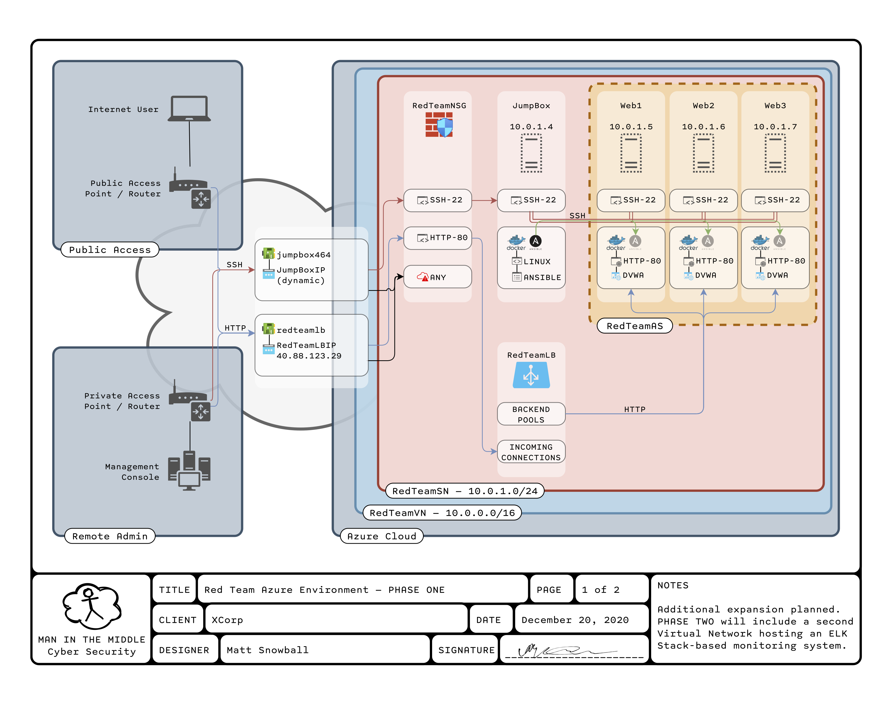
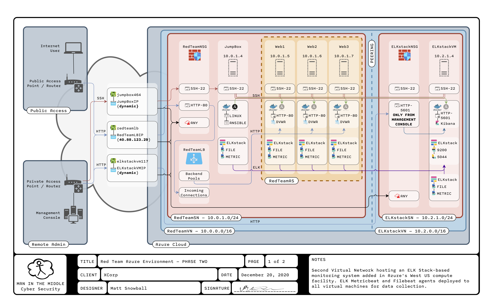
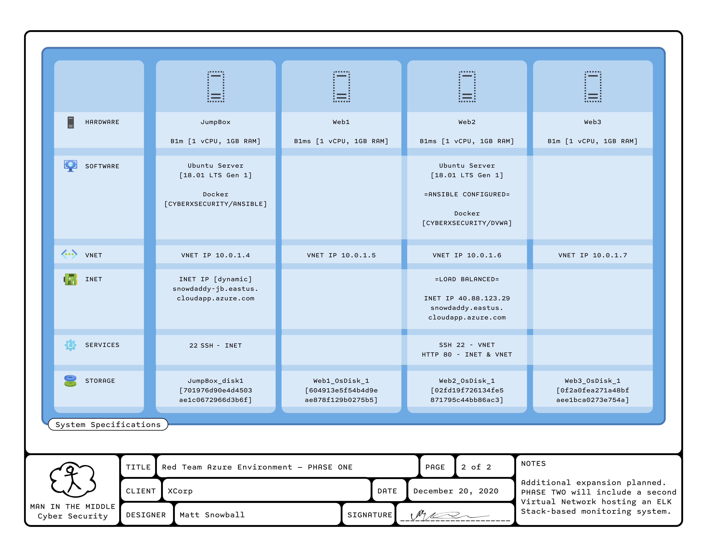
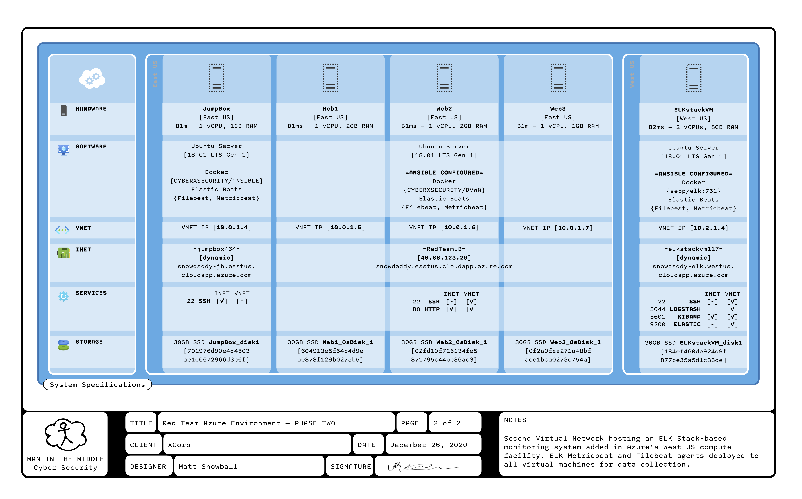
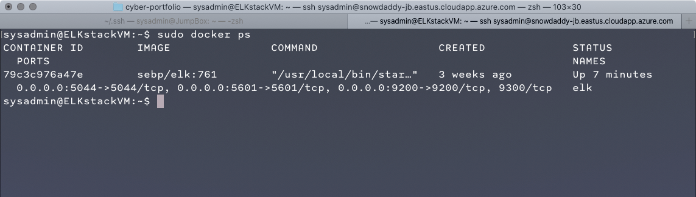

# Automated ELK Stack Deployment

These files have been tested and used to generate a live ELK deployment on Azure. They can be used to either recreate the entire deployment pictured above. Alternatively, select portions of the playbook file may be used to install only certain pieces of it, such as Filebeat.


| Combined Playbook | Component Playbooks |
|--|--|
|[ELK & Beats](install_elk_and_beats.yml)|[ELK Stack](install_elkstack.yml) — [Filebeat](install_filebeat.yml) — [Metricbeat](install_metricbeat.yml)

- The ELK Stack is installed to all machines in the `[elkstack]` group in the `/etc/ansible/hosts` file on the Ansible control node.

- The Metric- and Filebeats are installed to all machines listed in the `[elkagents]` group of `/etc/ansible/hosts`

This document contains the following details:
1. **Network Topology**
2. **Access Policies**
3. **ELK Configuration**
    1. **Beats in Use**
    2. **Machines Being Monitored**
4. **How to Use the Ansible Build**


## Description of the Topology

The main purpose of this network is to expose a load-balanced and monitored instance of DVWA, the D*mn Vulnerable Web Application.

The files in this repository were used to configure the network depicted below.


#### Phase One


[SVG](../diagrams/WMS-AzureCloudDocumentation-Phase1.svg) | [PDF](../diagrams/WMS-AzureCloudDocumentation-Phase1.pdf)

Load balancing ensures that the application will be highly available, in addition to restricting access to the network.  This adds both perimeter security as well as a defense against Denial of Service (DoS) attacks.

The network administration is all accomplished through a jump box virtual machine, using a process known as fanning out. A secure (SSH) connection is made to the jump box and from there connections are made into the rest of the virtual network.

#### Phase Two


[SVG](../diagrams/WMS-AzureCloudDocumentation-Phase2.svg) | [PDF](..diagrams/WMS-AzureCloudDocumentation-Phase2.pdf)

Integrating an ELK server allows users to easily monitor the vulnerable VMs for changes to the file system and system logs.

---

The configuration details of each machine may be found below.

| Name     |  | Function | IP Address | Operating System | Location |
|----------|--|----------|------------|------------------|----------|
| | | | | | |
| **PHASE ONE** | | | **10.0.1.0/24** | | |
| Jump Box || Gateway  | 10.0.1.4   | Ubuntu Server 18.01 LTS Gen 1 | East US |
| Web1     || HTTP Server (DVWA) | 10.0.1.5 | Ubuntu Server 18.01 LTS Gen 1 | East US |
| Web2     || HTTP Server (DVWA) | 10.0.1.6 | Ubuntu Server 18.01 LTS Gen 1 | East US |
| Web3     || HTTP Server (DVWA) | 10.0.1.7 | Ubuntu Server 18.01 LTS Gen 1 | East US |
| | | | | | |
| **PHASE TWO** ||| **10.2.1.0/24**|||
| ELKstackVM || ELK Stack* | 10.2.1.4  | Ubuntu Server 18.01 LTS Gen 1 | West US |
| | | | | | |

*ELK Stack consists of Elasticsearch, Logstash, and Kibana.

## Access Policies

The machines on the internal network are not exposed to the public Internet. 

Only the JumpBox machine can accept connections from the Internet. Access to this machine is only allowed from the following IP addresses:

> 104.247.230.211

Although at present this address is dynamically assigned and subject to change.

Machines within the network can only be accessed over SSH by way of the Ansible Control Node in the Docker Conatiner on the JumpBox machine.

A summary of the access policies in place can be found in the table below.

| From \ To  | JumpBox | Web1 | Web2 | Web3 | ELKstackVM | *Internet* |
|------------|----------|------|------|------|------------|
| JumpBox   | X | TCP 22, 80; ICMP | TCP 22, 80; ICMP | TCP 22, 80; ICMP | TCP 22, 6501, 5044, 9200; ICMP | ANY |
| Web1       | — | X | — | — | TCP 6501, 5044, 9200 | ANY |
| Web2       | — | — | X | — | TCP 6501, 5044, 9200 | ANY |
| Web3       | — | — | — | X | TCP 6501, 5044, 9200 | ANY |
||||||||
| ELKstackVM | — | — | — | — | X | ANY |
||||||||
| ***Internet*** | TCP 22* | TCP 80** | TCP 80** | TCP 80** | TCP 6501* | X |

*From specific IP address(es) [listed above] ONLY. 
**Through load balancer.

Further information can be found in the following diagrams:

#### Phase One


[SVG](../diagrams/WMS-AzureCloudDocumentation-Phase1.svg) | [PDF](../diagrams/WMS-AzureCloudDocumentation-Phase1.pdf)

---

#### Phase Two


[SVG](../diagrams/WMS-AzureCloudDocumentation-Phase1.svg) | [PDF](..diagrams/WMS-AzureCloudDocumentation-Phase1.pdf)

## Elk Configuration

Ansible was used to automate configuration of the ELK machine. No configuration was performed manually, which is advantageous because it saves time and effort. Instantly configures new systems by running an existing playbook, and just as easily, keeps those same systems up to date with a simple change of a version number. What could be better?

The playbook enacts the following tasks for machines in the host group `[elkstack]`:
- Becomes admin user
- Ensures `apache2` is not installed
- Installs `Docker.io`, `Python PIP`, and `Docker PIP`
- Increase Maximum Virtual Memory to `262144`
    - Persist Increase of System Memory Usage
- Install ELK Image and open necessary ports
    - Image `sebp/elk:761`
    - Ports `5601:5601`, `9200:9200`, `5044:5044`
- Make Docker Persistant via `systemd` Configuration

The following screenshot displays the result of running `docker ps` after successfully configuring the ELK instance.



### Target Machines & Beats
| This ELK server is configured to monitor the following machines: | We have installed the following Beats on these machines: |
|--|--|
| | |
| JumpBox — 10.0.1.4 | Filebeat, Metricbeat |
| Web1 — 10.0.1.5 | Filebeat, Metricbeat |
| Web2 — 10.0.1.6 | Filebeat, Metricbeat |
| Web3 — 10.0.1.7 | Filebeat, Metricbeat |
| | |
| ELKstackVM — 10.2.1.4 | Filebeat, Metricbeat |

These Beats allow us to collect the following information from each machine:

| Metricbeat | Filebeat |
|--|--|
|||
| system-level CPU usage, memory, file system, disk IO, and network IO statistics |observability and security data sources that simplify the collection, parsing, and visualization of common log formats |

## Using the Playbook
In order to use the playbook, you will need to have an Ansible control node already configured. Assuming you have such a control node provisioned: 

SSH into the control node and follow the steps below:
1. Copy the playbook file(s) to /etc/ansible/.
2. Update the `/etc/ansible/ansible.cfg` file to include a custom `remote_user parameter`.  Update line 107, such that: 

    ```
    # default user to use for playbooks if user is not specified
    # (/usr/bin/ansible will use current user as default)
    # remote_user = sysadmin
    ```
    becomes:
    ```
    # default user to use for playbooks if user is not specified
    # (/usr/bin/ansible will use current user as default)
    remote_user = sysadmin
    ```
    
    - [Download example 'ansible.cfg' file](ansible.cfg)
3. Add the following groups to`/etc/ansible/hosts` file on the Ansible control node.
    - `[elkstack]` The ELK Stack (Elasticsearch, Logstash, and Kibana) is installed to all machines in this group
        ```
        [elkstack]
        10.2.1.4 ansible_python_interpreter=/usr/bin/python3
        ```

    - `[elkagents]` The Metric- and Filebeats are installed to all machines listed under this group
        ```
        [elkagents]
        10.0.1.5 ansible_python_interpreter=/usr/bin/python3
        10.0.1.6 ansible_python_interpreter=/usr/bin/python3
        10.0.1.7 ansible_python_interpreter=/usr/bin/python3
        
        10.2.1.4 ansible_python_interpreter=/usr/bin/python3
        ```
        
    - [Download example 'hosts' file](hosts)


4. Run the playbook, and navigate to `http://<ELKstack_IP>:5601` to check that the installation worked as expected.
